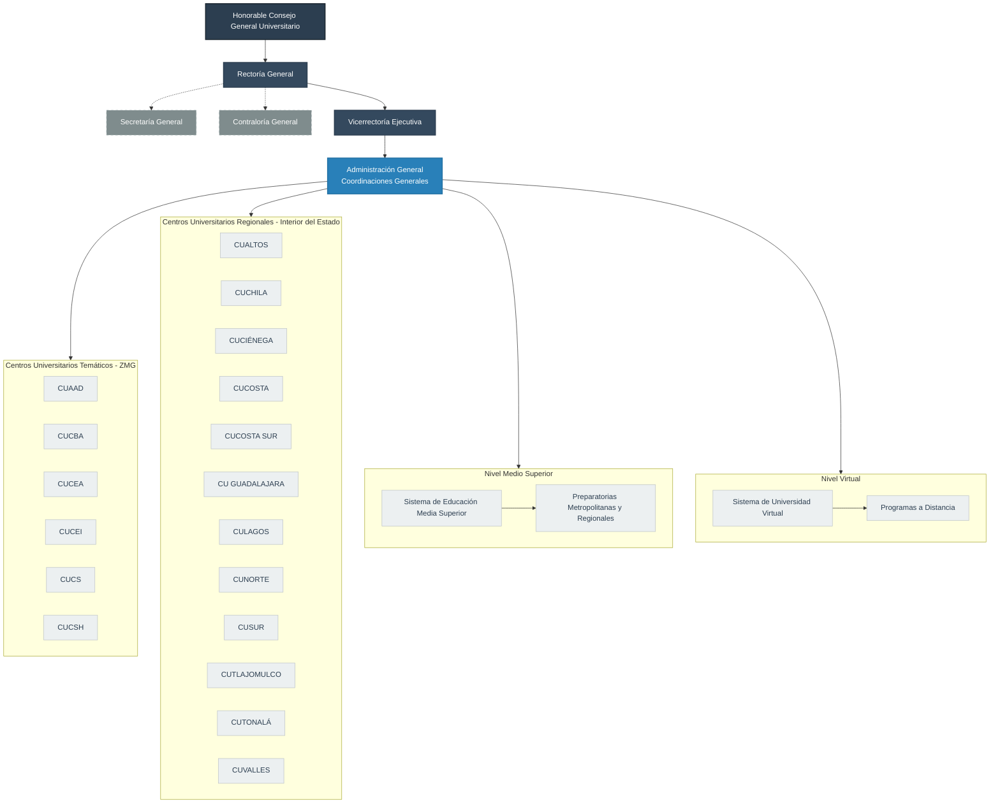

```mermaid
graph TD
    %% Estilos de Diseño
    classDef gobierno fill:#2c3e50,stroke:#1a252f,stroke-width:2px,color:#fff;
    classDef ejecutivo fill:#34495e,stroke:#2c3e50,stroke-width:2px,color:#fff;
    classDef staff fill:#7f8c8d,stroke:#95a5a6,stroke-width:1px,color:#fff,stroke-dasharray: 5 5;
    classDef admin fill:#2980b9,stroke:#2471a3,stroke-width:2px,color:#fff;
    classDef operativo fill:#ecf0f1,stroke:#bdc3c7,stroke-width:1px,color:#2c3e50;

    %% --- NIVEL 1: Máxima Autoridad ---
    CGU[Honorable Consejo General Universitario]:::gobierno

    %% --- NIVEL 2: Dirección Ejecutiva y Staff ---
    RG[Rectoría General]:::ejecutivo
    SG[Secretaría General]:::staff
    CONT[Contraloría General]:::staff
    VE[Vicerrectoría Ejecutiva]:::ejecutivo

    %% Conexiones Nivel 1 y 2
    CGU --> RG
    RG -.-> SG
    RG -.-> CONT
    RG --> VE

    %% --- NIVEL 3: Administración General ---
    AG[Administración General <br> Coordinaciones Generales]:::admin
    VE --> AG

    %% --- NIVEL 4: Red Universitaria Operativa ---
    subgraph CT [Centros Universitarios Temáticos - ZMG]
        CUAAD[CUAAD]:::operativo
        CUCBA[CUCBA]:::operativo
        CUCEA[CUCEA]:::operativo
        CUCEI[CUCEI]:::operativo
        CUCS[CUCS]:::operativo
        CUCSH[CUCSH]:::operativo
    end

    subgraph CR [Centros Universitarios Regionales - Interior del Estado]
        CUALTOS[CUALTOS]:::operativo
        CUCHILA[CUCHILA]:::operativo
        CUCIENEGA[CUCIÉNEGA]:::operativo
        CUCOSTA[CUCOSTA]:::operativo
        CUCOSTASUR[CUCOSTA SUR]:::operativo
        CUGUADALAJARA[CU GUADALAJARA]:::operativo
        CULAGOS[CULAGOS]:::operativo
        CUNORTE[CUNORTE]:::operativo
        CUSUR[CUSUR]:::operativo
        CUTLAJOMULCO[CUTLAJOMULCO]:::operativo
        CUTONALA[CUTONALÁ]:::operativo
        CUVALLES[CUVALLES]:::operativo
    end

    subgraph SEMS_BLOCK [Nivel Medio Superior]
        SEMS[Sistema de Educación Media Superior]:::operativo
        PREPAS[Preparatorias Metropolitanas y Regionales]:::operativo
        SEMS --> PREPAS
    end

    subgraph SUV_BLOCK [Nivel Virtual]
        SUV[Sistema de Universidad Virtual]:::operativo
        VIRTUAL[Programas a Distancia]:::operativo
        SUV --> VIRTUAL
    end

    %% Conexiones de la Administración hacia la Base Operativa
    AG --> CT
    AG --> CR
    AG --> SEMS_BLOCK
    AG --> SUV_BLOCK
```
